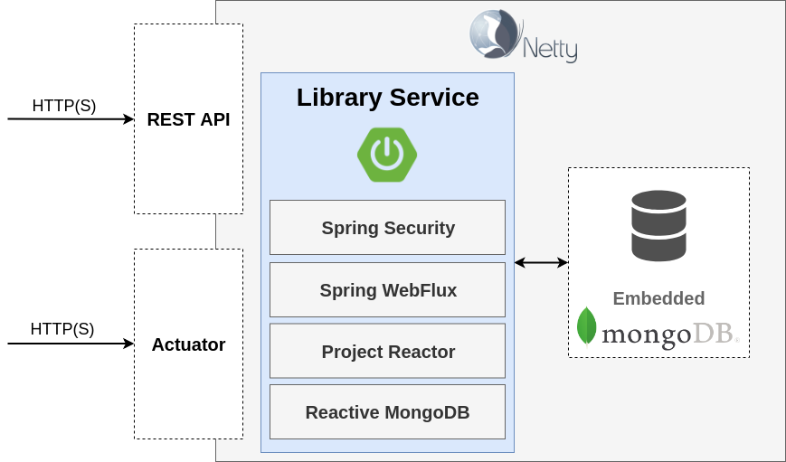
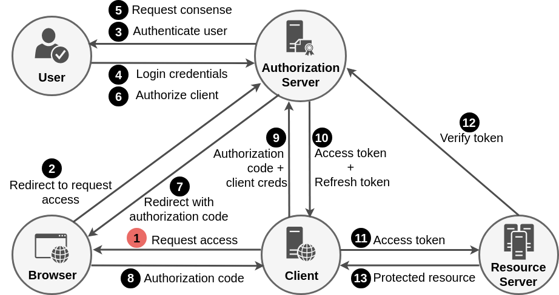
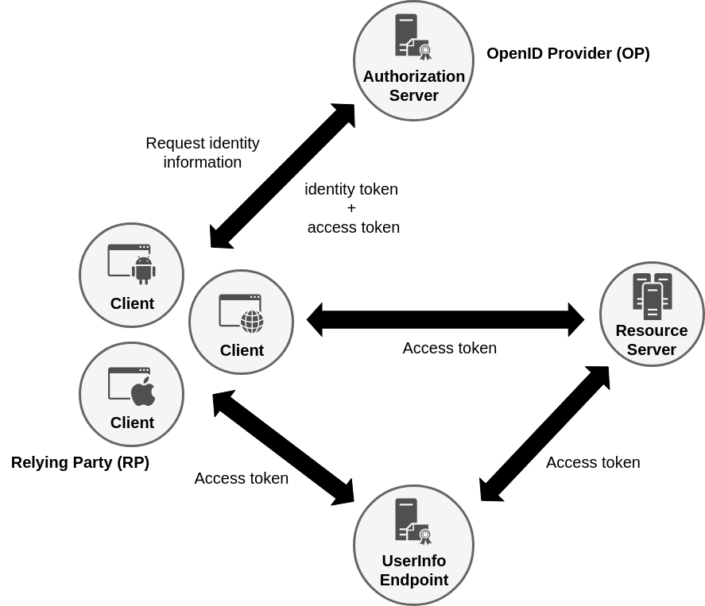

= Reactive Spring Security 5.1 Hands-On Workshop
Andreas Falk <andreas.falk@novatec-gmbh.de>
:favicon: ./images/favicon.png
:doctype: book
:icons: font
:source-highlighter: highlightjs
:toc: left
:toclevels: 3
:sectlinks:
:sectanchors:
:numbered: ''
:docinfo:

.Reactive Spring Security 5 Workshop

image::images/reactor_spring.png[scaledwidth="40%", scaledheight="40%",alt="novatec"]

.Welcome to the **Reactive Spring Security 5.1 Hands-On Workshop**.

[quote, Jim Manico]
From my experience all software developers are now security engineers whether they know it, admit to it or do it.
Your code is now the security of the org you work for.

Target of this workshop is to learn how to make an initially unsecured (reactive) web application
more and more secure step-by-step.

You will make your hands dirty in code in the following steps:

1. Add spring boot security starter dependency for simple auto configuration of security
2. Customize authentication configuration (provide our own user store + encryption)
3. Add authorization (access controls) to web and method layers
4. Implement automated security integration tests
5. Experiment with new OAuth2 Login Client and Resource Server of Spring Security 5.1

== Requirements for this workshop

* Git
* A Java JDK (Java 8, 9 or 11 are supported and tested)
* Any Java IDE capable of building with https://gradle.org/[Gradle] (IntelliJ, Eclipse, VS Code, ...)
* Basic knowledge of https://www.reactivemanifesto.org[Reactive Systems] and reactive programming using https://docs.spring.io/spring/docs/current/spring-framework-reference/web-reactive.html#spring-webflux[Spring WebFlux] & https://projectreactor.io[Reactor]
* https://curl.haxx.se[Curl] or https://httpie.org[Httpie] to call the REST API from command line
* https://robomongo.org[Robo 3T] to look inside the embedded MongoDB instance

As we are building the samples using https://gradle.org[Gradle] your Java IDE should be capable use this.
As IntelliJ user support for https://gradle.org/[Gradle] is included by default.
As an Eclipse user you have to install a plugin via the marketplace

.Eclipse Marketplace for Gradle integration

image::images/eclipse_gradle.png[scaledwidth="50%", scaledheight="50%",alt="eclipse_gradle"]

To get the workshop project you either can just clone the repository using

```
git clone https://github.com/andifalk/reactive-spring-security-5-workshop.git security_workshop
```

or

```
 git clone git@github.com:andifalk/reactive-spring-security-5-workshop.git security_workshop
```

or simply download it as a https://github.com/andifalk/reactive-spring-security-5-workshop/archive/master.zip[zip archive].

After that you can import the workshop project into your IDE

* IntelliJ: "New project from existing sources..."
* Eclipse: "Import/Gradle/Existing gradle project"
* Visual Studio Code: Just open the corresponding project directory

== Common Web Security Risks

In this workshop you will strive various parts of securing a web application that
fit into the https://www.owasp.org/index.php/Top_10-2017_Top_10[OWASP Top 10 2017 list].

We will look at:

- https://www.owasp.org/index.php/Top_10-2017_A2-Broken_Authentication[A2: Broken Authentication]
- https://www.owasp.org/index.php/Top_10-2017_A3-Sensitive_Data_Exposure[A3: Sensitive Data Exposure]
- https://www.owasp.org/index.php/Top_10-2017_A5-Broken_Access_Control[A5: Broken Access Control]
- https://www.owasp.org/index.php/Top_10-2017_A6-Security_Misconfiguration[A6: Security Misconfiguration]
- https://www.owasp.org/index.php/Top_10-2017_A9-Using_Components_with_Known_Vulnerabilities[A9: Using components with known vulnerabilities]
- https://www.owasp.org/index.php/Top_10-2017_A10-Insufficient_Logging%26Monitoring[A10: Insufficient Logging & Monitoring]

.OWASP Top 10 2017

image::images/owasp_top_10_2017.png[scaledwidth="50%", scaledheight="50%",alt="owasp_top_10"]

The https://owasp.org[Open Web Application Security Project] has plenty of further free resources available.

As a developer you may also have a look into the https://www.owasp.org/index.php/OWASP_Proactive_Controls[OWASP ProActive Controls] document which describes how to develop
your applications using good security patterns.
To help getting all security requirements right for your project and how to test these the https://github.com/OWASP/ASVS[Application Security Verification Standard] can help you here.

[NOTE]
====
You will find more sources of information about security referenced in the <<References>> section.
====

== Reactive Systems & Streams

The following subsections give a very condensed introduction to the basics of Reactive Systems,
the Project Reactor and Spring WebFlux. +
This might help to better understand the sample application for beginners of Reactive.

[quote, https://www.reactivemanifesto.org]
Reactive Systems are Responsive, Resilient, Elastic and Message Driven (Asynchronous).

* *Responsiveness* means the system responds in a timely manner and is the cornerstone of usability
* *Resilience* means the system stays responsive in the face of failure
* *Elasticity* means that the throughput of a system scales up or down automatically to
meet varying demand as resource is proportionally added or removed
* *Message Driven* systems rely on asynchronous message-passing to establish a boundary between components
that ensures loose coupling

[quote, http://www.reactive-streams.org/]
Reactive Streams is an initiative to provide a standard for asynchronous stream processing with non-blocking back pressure..

* *Back-Pressure*: When one component is struggling to keep-up, the system as a whole needs to respond in a sensible way.
Back-pressure is an important feedback mechanism that allows systems to gracefully respond to load rather than
collapse under it.

=== Project Reactor

The project https://projectreactor.io[Reactor] is a Reactive library for building non-blocking applications on
the JVM based on the http://www.reactive-streams.org[Reactive Streams Specification] and can help to build
Reactive Systems.

Reactor is a fully non-blocking foundation and offers backpressure-ready
network engines for HTTP (including Websockets), TCP and UDP.

Reactor introduces composable reactive types that implement Publisher but also provide a rich vocabulary of operators,
most notably _Flux_ and _Mono_.

A _Mono<T>_ is a specialized _Publisher<T>_ that emits at most one item and then optionally terminates with
an onComplete signal or an onError signal.

.Mono, an Asynchronous 0-1 Result (source: projectreactor.io)

image::images/mono.png[scaledwidth="80%", scaledheight="80%",alt="reactor_mono"]

A _Flux<T>_ is a standard _Publisher<T>_ representing an asynchronous sequence of 0 to N emitted items,
optionally terminated by either a completion signal or an error.

.Flux, an Asynchronous Sequence of 0-N Items (source: projectreactor.io)

image::images/flux.png[scaledwidth="80%", scaledheight="80%",alt="reactor_flux"]

=== Spring WebFlux

https://docs.spring.io/spring/docs/current/spring-framework-reference/web-reactive.html#spring-webflux[Spring WebFlux]
was added in Spring Framework 5.0. It is fully non-blocking, supports Reactive Streams back pressure, and runs
on servers such as Netty, Undertow, and Servlet 3.1+ containers.

Spring Webflux depends on Reactor and uses it internally to compose asynchronous logic
and to provide Reactive Streams support.
It provides two programming models:

* Annotated Controllers: This is uses the same annotations as in the Spring MVC part
* Functional Endpoints:  This provides a lambda-based, lightweight, functional programming model

== Intro-Lab: Reactive Programming

Before we dive into the world of security, you have the chance to get a first glimpse on the difference between
imperative and reactive programming style.

To do this we will look into the project **intro-labs/reactive-playground**.

The following resources might be helpful for first steps into the reactive world:

* https://projectreactor.io/docs/core/release/reference/[Project Reactor Reference Documentation]
* https://projectreactor.io/docs/core/release/reference/#which-operator[Which operator do I need?]

== The workshop application

In this workshop you will be provided a finished but completely unsecured reactive
web application.
This library server application provides a https://martinfowler.com/articles/richardsonMaturityModel.html[RESTful service]
for administering books and users.

You can find this provided workshop application in sub project **lab-1/initial-library-server**.

This will also be your **starting point** into the hands-on part that we will dive into shortly.


.The workshop application

image::images/workshop_lab_1.png[scaledwidth="75%",alt="Library service"]

The RESTful service for books is build using the Spring WebFlux annotation model and the RESTful service for
users is build using the Spring WebFlux router model.

The application contains a complete documentation for the RESTful API build with spring rest docs
which you can find in the directory _build/asciidoc/html5_
after performing a full gradle build.

The domain model of this application is quite simple and just consists of _Book_ and _User_.
The packages of the application are organized as follows:

- *api*: Contains the complete RESTful service
- *business*: All the service classes (quite simple for workshop, usually containing business logic)
- *dataaccess*: All domain models and repositories
- *config*: All spring configuration classes
- *common*: Common classes used by several other packages

.Library service stack



[NOTE]
====
To call the provided REST API you can use https://curl.haxx.se[curl] or https://httpie.org[httpie].
For details on how to call the REST API please consult
the https://andifalk.github.io/reactive-spring-security-5-workshop/api-doc.html[REST API documentation]
which also provides sample requests for _curl_ and _httpie_.
====

There are three target user roles for this application:

- *Standard users*: A standard user can borrow and return his currently borrowed books
- *Curators*: A curator user can add or delete books
- *Administrators*: An administrator user can add or remove users

If you are going into reactive systems this works best if all layers work in non-blocking reactive style.
Therefore the application is build using:

- Spring 5 WebFlux on Netty
- Spring Data MongoDB with reactive driver
- In-memory Mongodb to have an easier setup for the workshop

== Basic Security Labs

To start the workshop please begin by adapting the **lab-1/initial-library-server**

[NOTE]
====
If you are not able to keep up with completing a particular step you
always can just start over with the existing application of next step.

For example if you could not complete the lab 1 in time
just continue with lab 2 using **lab-1/complete-library-server** as new starting point.
====

=== Run the initial application

To ensure your java environment is configured correctly please run the initial
workshop application.

To achieve this run the class _com.example.library.server.InitialLibraryServerApplication_ in project **lab-1/initial-library-server**.

This should also start the embedded MongoDB instance. In case you get an error here telling that the corresponding port _40495_
is already bound to another service then please change the configuration to a different port in file _application.yml_:

```
spring:
  data:
    mongodb:
      port: 40495
```

To look into the embedded MongoDB instance the UI tool https://robomongo.org/[Robo 3T] is
very helpful and easy to use. In case you did not yet install this tool just go to
https://robomongo.org/download and download the corresponding file for your operating system
(please do NOT download the commercial variant named _Studio 3T_).

After you downloaded the install file and extracted/installed the tool you have to configure
the connection to the embedded MongoDB like in the following figure.
If you have configured your embedded MongoDB instance to a different port then use that one
instead of _40495_.

.Robo 3T Connection configuration

image::images/robo3t.png[scaledwidth="75%",alt="Library service stack"]

Finally you can navigate your web browser to http://localhost:9091/books then you
should see a list of books.

You can achieve the same on the command line using https://httpie.org/[httpie]
or https://curl.haxx.se/download.html[curl].

.Curl

```
curl 'http://localhost:9091/books' | jq
```

.Httpie

```
http localhost:9091/books
```

If both the workshop application and the Robo 3T tool run fine and you could see
the list of books then you are setup and ready to start the first lab.

So head over to the next section and start with Lab 1.


=== Lab 1: Auto Configuration

.In the first step we start quite easy by just adding the spring boot starter dependency for spring security.

We just need to add the following two dependencies to the _build.gradle_ file of the initial application (lab-1/initial-library-server_).

.build.gradle

include::{snippets}/step-1-gradle-build.adoc[]

.Authentication using in-memory user

image::images/workshop_lab_3.png[scaledwidth="75%",alt="Library service authentication"]

Please start the application by running the class _InitialLibraryServerApplication_.

==== Login

Spring Security 5 added a nicer auto-generated login form (build with bootstrap library).

.Autogenerated login formular

image::images/loginform.png[scaledwidth="40%", scaledheight="40%",alt="owasp_top_10"]

If you browse to http://localhost:8080/books[localhost:8080/books] then you will notice
that a login form appears in the browser window.

[TIP]
====
But wait - what are the credentials for a user to log in?

With spring security autoconfigured by spring boot the credentials are as follows:

* Username=user
* Password=<Look into the console log!>
====

.console log

include::{snippets}/step-1-default-password-console.adoc[]

Of course you won't use the generated password for any serious application as this will change with each restart of the
application.

Instead you can easily just change the password to a static value by changing the _application.yaml_ file.

.application.yml

```
spring:
  ...
  security:
    user:
      password: secret
```

[NOTE]
====
Please make sure the indents of the content is correct in yaml formatted files. If this is not the case you can get
really strange errors sometimes.
====

As you can see, if Spring Security is on the classpath,
then the web application is secured by default.
https://docs.spring.io/spring-boot/docs/current/reference/htmlsingle/#boot-features-security[Spring boot] auto-configured
basic authentication and form based authentication for all web endpoints.

[NOTE]
====
https://www.owasp.org/index.php/Top_10-2017_A5-Broken_Access_Control[OWASP Top 10-2017 A5-Broken Access Control]

- With the exception of public resources, deny by default
====

.Form-based authentication with session cookies

image::images/session_auth.png[scaledwidth="50%", scaledheight="50%",alt="form_login"]

This also applies to all actuator endpoints like http://localhost:8080/actuator/health[/actuator/health].
All monitoring web endpoints can now only be accessed with an authenticated user.
See https://docs.spring.io/spring-boot/docs/current/reference/htmlsingle/#boot-features-security-actuator[Actuator Security]
for details.

==== Common Security Problems

Additionally spring security improved the security of the web application automatically for:

* https://docs.spring.io/spring-security/site/docs/current/reference/htmlsingle/#ns-session-fixation[Session Fixation]:
Session Fixation is an attack that permits an attacker to hijack a valid user session. +
If you want to learn more about this please read the https://www.owasp.org/index.php/Session_fixation[Session Fixation page at OWASP]
* https://docs.spring.io/spring-security/site/docs/current/reference/htmlsingle/#csrf[Cross Site Request Forgery (CSRF)]:
Cross-Site Request Forgery (CSRF) is an attack that forces an end user to execute unwanted actions on a web application in which they're currently authenticated. +
If you want to know what CSRF really is and how to mitigate this attack please consult https://www.owasp.org/index.php/Cross-Site_Request_Forgery_(CSRF)[CSRF attack description at OWASP]

* https://docs.spring.io/spring-security/site/docs/current/reference/htmlsingle/#default-security-headers[Default Security Headers]:
This automatically adds all recommended security response headers to all http responses. You can find more information about this topic
   in the https://www.owasp.org/index.php/OWASP_Secure_Headers_Project#tab=Main[OWASP Secure Headers Project]

.default security response headers

include::{snippets}/step-1-security-response-header.adoc[]

==== Logout

Spring security 5 also added a bit more user friendly logout functionality out of the box.
If you direct your browser to http://localhost:8080/logout[localhost:8080/logout] you will see the following
dialog on the screen.

.Autogenerated logout formular

image::images/logoutform.png[scaledwidth="40%", scaledheight="40%",alt="owasp_top_10"]

The application already contains a central error handler for the whole web application using _@RestControllerAdvice_.
You can find this in class _com.example.library.server.api.ErrorHandler_.

To handle potential future access denied error we add the following new block to this class:

.com.example.library.server.api.ErrorHandler

```
import org.springframework.security.access.AccessDeniedException;

@RestControllerAdvice
public class ErrorHandler {

@ExceptionHandler(AccessDeniedException.class)
public Mono<ResponseEntity<String>> handle(AccessDeniedException ex) {
Logger logger = LoggerFactory.getLogger(this.getClass());
logger.error(ex.getMessage());
return Mono.just(ResponseEntity.status(HttpStatus.FORBIDDEN).build());
}
...
```

[NOTE]
====
If you try to run the existing tests in package _com.example.library.server.api_ you will
notice that these are not _green_ any more. This is due to the security enforcements
by Spring Security.
====

Now all requests in the tests require an authenticated user and fail with http status 401 (Unauhorized).

All tests using requests with _POST_, _PUT_ or _DELETE_ methods are failing with http status 403 (Forbidden).
These requests are now protected against https://www.owasp.org/index.php/Cross-Site_Request_Forgery_(CSRF)[CSRF] attacks
and require CSRF tokens.

To achieve authentication in the tests you have to add the annotation _@WithMockUser_ on class level.
CSRF is handled by mutating the requests inside the tests by adding this snippet to the failing tests:

.com.example.library.server.api.BookApiDocumentationTest

```
...
import static org.springframework.security.test.web.reactive.server.SecurityMockServerConfigurers.csrf;
...
webTestClient
        .mutateWith(csrf())
        ...
```


This concludes the first step.

[NOTE]
====
You find the completed code in project **lab-1/complete-library-server**.
====

Now let's proceed to next step and start with customizing the authentication part.

=== Lab 2: Customize Authentication

.Now it is time to start customizing the auto-configuration.

The spring boot auto-configuration will back-off a bit in this lab and will back-off completely in next step.

.Custom authentication with persistent users

image::images/workshop_lab_4.png[scaledwidth="75%",alt="Library service custom authentication"]

Before we start let's look into some internal details how spring security works
for the reactive web stack.

==== WebFilter

Like the _javax.servlet.Filter_ in the blocking servlet-based web stack there is a comparable functionality
in the reactive world: The _WebFilter_.

.WebFilter

include::{snippets}/step-2-web-filter.adoc[]

By using the _WebFilter_ you can add functionality that called around each request and response.

.Spring Security WebFilter
|===
|Filter |Description
|AuthenticationWebFilter
|Performs authentication of a particular request
|AuthorizationWebFilter
|Determines if an authenticated user has access to a specific object
|CorsWebFilter
|Handles CORS preflight requests and intercepts
|CsrfWebFilter
|Applies https://www.owasp.org/index.php/Cross-Site_Request_Forgery_(CSRF)[CSRF] protection using a synchronizer token pattern.
|===

To see how such a _WebFilter_ works we will implement a simple _LoggingWebFilter_:

.LoggingWebFilter

include::{snippets}/step-2-logging-web-filter.adoc[]

==== WebFilterChainProxy

In lab 1 we just used the auto configuration of Spring Boot.
This configured the default security settings as follows:

.Default security configuration (with Spring Boot)

include::{snippets}/step-2-default-security-config.adoc[]

As you can see this uses a _SecurityWebFilterChain_ as central component.

.SecurityWebFilterChain

include::{snippets}/step-2-security-web-filter-chain.adoc[]

To customize the spring security configuration you have to implement one or more
of _SecurityWebFilterChain_ configuration methods.

These are handled centrally by the _WebFilterChainProxy_ class.

.WebFilterChainProxy

include::{snippets}/step-2-web-filter-chain-proxy.adoc[]

==== Step 1: Encoding Passwords

[NOTE]
====
https://www.owasp.org/index.php/Top_10-2017_A3-Sensitive_Data_Exposure[OWASP Top 10-2017 A3-Sensitive Data Exposure]

- Make sure to encrypt all sensitive data at rest
- Store passwords using strong adaptive and salted hashing functions with a work factor (delay factor),
  such as Argon2, scrypt, bcrypt or PBKDF2
====

We start by replacing the default user/password with our own persistent user storage (already present in MongoDB).
To do this we add a new class _WebSecurityConfiguration_ to package _com.example.library.server.config_ having the following
contents.

.WebSecurityConfiguration class

include::{snippets}/step-2-password-encoder-config.adoc[]

The _WebSecurityConfiguration_ implementation does two important things:

. This adds the _SecurityWebFilterChain_. If you already have secured servlet based spring mvc web applications
  then you might know what's called the
  https://docs.spring.io/spring-security/site/docs/current/reference/htmlsingle/#security-filter-chain[_spring security filter chain_].
  In spring webflux the _SecurityWebFilterChain_ is the similar approach
  based on matching a request with one or more WebFilter.
. Configures a _PasswordEncoder_. A password encoder is used by spring security to encode (hash) passwords and to check
  if a given password matches the encrypted one.

.PasswordEncoder interface

include::{snippets}/step-2-password-encoder.adoc[]

In spring security 5 creating an instance of the _DelegatingPasswordEncoder_ is much easier
by using the class _PasswordEncoderFactories_. In past years several previously used password encryption algorithms
have been broken (like _MD4_ or _MD5_). By using _PasswordEncoderFactories_ you always get a configured
_DelegatingPasswordEncoder_ instance that configures a map of _PasswordEncoder_ instances for the recommended password hashing algorithms like

* https://en.wikipedia.org/wiki/Bcrypt[Bcrypt]
* https://en.wikipedia.org/wiki/Scrypt[Scrypt]
* https://en.wikipedia.org/wiki/PBKDF2[PBKDF2]

At the time of creating this workshop the _DelegatingPasswordEncoder_ instance configures the _Bcrypt_ algorithm
as the default to be used for encoding new passwords.

If you want to know more about why to use hashing algorithms like Bcrypt, Scrypt or PBKDF2 instead of other ones like SHA-2 then
read the very informative blog post https://security.blogoverflow.com/2013/09/about-secure-password-hashing[About Secure Password Hashing].

.DelegatingPasswordEncoder class

include::{snippets}/step-2-delegating-password-encoder.adoc[]

To have encrypted passwords in our MongoDB store we need to tweak our existing _DataInitializer_ a bit with the
_PasswordEncoder_ we just have configured.

.DataInitializer class

include::{snippets}/step-2-data-initializer.adoc[]

==== Step 2: Persistent User Storage

Now that we already have configured the encoding part for passwords of our user storage
we need to connect our own user store (the users already stored in the MongoDB) with spring security's
authentication manager.

This is done in two steps:

In the first step we need to implement spring security's definition of a user called _UserDetails_.

.LibraryUser class

include::{snippets}/step-2-library-user.adoc[]

In the second step we need to implement spring security's interface _ReactiveUserDetailsService_ to integrate our user store with the authentication manager.

.LibraryReactiveUserDetailsService class

include::{snippets}/step-2-library-user-details-service.adoc[]

After completing this part of the workshop we now still have the auto-configured _SecurityWebFilterChain_ but we have
replaced the default user with our own users from our MongoDB persistent storage.

If you restart the application now you have to use the following user credentials to log in:

===== Users and roles

There are three target user roles for this application:

* LIBRARY_USER: Standard library user who can list, borrow and return his currently borrowed books
* LIBRARY_CURATOR: A curator user who can add, edit or delete books
* LIBRARY_ADMIN: An administrator user who can list, add or remove users

__Important:__ We will use the following users in all subsequent labs from now on:

.User credentials
|===
| Username | Email | Password | Roles
|bwayne
|bruce.wayne@example.com
|wayne
|LIBRARY_USER
|bbanner
|bruce.banner@example.com
|banner
|LIBRARY_USER
|pparker
|peter.parker@example.com
|parker
|LIBRARY_CURATOR
|ckent
|clark.kent@example.com
|kent
|LIBRARY_ADMIN
|===

=== Automatic Password Encoding Updates

We already looked into the _DelegatingPasswordEncoder_ and _PasswordEncoderFactories_. As these classes have knowledge
about all encryption algorithms that are supported in spring security, the framework can detect
an _outdated_ encryption algorithm. By extending our already existing _LibraryReactiveUserDetailsService_ class
with the additionally provided interface _ReactiveUserDetailsPasswordService_ we can now enable an automatic
password encryption upgrade mechanism.

The _ReactiveUserDetailsPasswordService_ interface just defines one more operation.

.ReactiveUserDetailsPasswordService interface

include::{snippets}/step-2-reactive-user-details-password-service.adoc[]

First we need a user having a password that is encoded using an _outdated_ hashing algorithm. We achieve this by modifying
the existing _DataInitializer_ class.

.DataInitializer class

include::{snippets}/step-2-data-initializer-old-user.adoc[]

To activate support for automatic password encoding upgrades we need to extend our existing
_LibraryReactiveUserDetailsService_ class.

.LibraryReactiveUserDetailsService class

include::{snippets}/step-2-library-user-details-password-service.adoc[]

Now restart the application and see what happens if we try to get the list of books using this new
user (username='old@example.com', password='user').

In the console you should see the log output showing the old _MD5_ password being updated to _Bcrypt_ password.

[CAUTION]
====
Never log any sensitive data like passwords, tokens etc., even in hashed format. Also never put such sensitive data
into your version control. And never let error details reach the client (via REST API or web application).
Make sure you disable stacktraces in client error messages using property _server.error.include-stacktrace=never_
====

This is the end of lab 2 of the workshop.

[NOTE]
====
You find the completed code in project **lab-2/complete-library-server**.
====

In the next workshop part we also adapt the _SecurityWebFilterChain_ to our needs and add authorization rules (in web and method layer)
for our application.

=== Lab 3: Add Authorization

.In this part of the workshop we want to add our customized authorization rules for our application.

As a result of the previous workshop steps we now have authentication for all our web endpoints
(including the actuator endpoints) and we can log in using our own users. But here security does not stop.

We know who is using our application (*authentication*) but we do not have control over what this user is
allowed to do in our application (*authorization*).

.Authorization for library-service

image::images/workshop_lab_5.png[scaledwidth="75%",alt="Library service authorization"]

[NOTE]
====
https://www.owasp.org/index.php/Top_10-2017_A5-Broken_Access_Control[OWASP Top 10-2017 A5-Broken Access Control]

- With the exception of public resources, deny by default
- Implement access control mechanisms once and re-use them throughout the application, including minimizing CORS usage.
====

As a best practice the authorization should always be implemented on different layers like the web and method layer.
This way the authorization still prohibits access even if a user manages to bypass the web url based authorization filter
by playing around with manipulated URL's.

Our required authorization rule matrix looks like this:

.Authorization rules for library-server
|===
|URL | Http method|Restricted|Roles with access
|/*.css,/*.jpg,/*.ico,...
|All
|No
|--
|/books/{bookId}/borrow
|POST
|Yes
|LIBRARY_USER
|/books/{bookId}/return
|POST
|Yes
|LIBRARY_USER
|/books
|POST
|Yes
|LIBRARY_CURATOR
|/books
|DELETE
|Yes
|LIBRARY_CURATOR
|/users
|All
|Yes
|LIBRARY_ADMIN
|/actuator/health
|GET
|No
|--
|/actuator/info
|GET
|No
|--
|/actuator/*
|GET
|Yes
|LIBRARY_ADMIN
|/*
|All
|Yes
|All authenticated ones
|===

All the web layer authorization rules are configured in the _WebSecurityConfiguration_ class by adding
a new bean for _SecurityWebFilterChain_. Here we also already switch on the support for method layer authorization
by adding the annotation _@EnableReactiveMethodSecurity_.

.WebSecurityConfiguration class

include::{snippets}/step-3-spring-security-filter-chain.adoc[]

We also add a a _ServerLogoutSuccessHandler_ bean to redirect back to the _/books_ endpoint after a logout
to omit the error message we got so far by redirecting to a non-existing page.

We continue with authorization on the method layer by adding the rules to our business service classes
_BookService_ and _UserService_. To achieve this we use the _@PreAuthorize_ annotations provided by spring security.
Same as other spring annotations (e.g. @Transactional) you can put _@PreAuthorize_ annotations on global class level
or on method level.

Depending on your authorization model you may use _@PreAuthorize_ to authorize using static roles or
to authorize using dynamic expressions (usually if you have roles with permissions).

.Roles and Permissions

image::images/roles_permissions.png[scaledwidth="50%", scaledheight="50%",alt="roles_permissions"]

If you want to have a permission based authorization you can use the predefined interface _PermissionEvaluator_ inside the
_@PreAuthorize_ annotations like this:

```
class MyService {
    @PreAuthorize("hasPermission(#uuid, 'user', 'write')")
    void myOperation(UUID uuid) {...}
}
```

.PermissionEvaluator class

include::{snippets}/step-3-permission-evaluator.adoc[]

In the workshop due to time constraints we have to keep things simple so we just use static roles. +
Here it is done for the all operations of the book service.

.BookService class

include::{snippets}/step-3-book-authorization.adoc[]

And now we add it the same way for the all operations of the user service.

.UserService class

include::{snippets}/step-3-user-authorization.adoc[]

Now that we have the current user context available in our application we can use this to automatically
set this user as the one who has borrowed a book or returns his borrowed book. The current user can always be evaluated
using the _ReactiveSecurityContextHolder_ class. But a more elegant way is to just let the framework put the current user
directly into our operation via _@AuthenticationPrincipal_ annotation.

.BookRestController class

include::{snippets}/step-3-authentication-principal.adoc[]

So please go ahead and re-start the application and try to borrow a book with an authenticated user.

.httpie get list of books

```
http localhost:9091/books --auth 'bruce.wayne@example.com:wayne'
```

.httpie borrow a book

```
http POST localhost:9091/books/{bookId}/borrow --auth 'bruce.wayne@example.com:wayne'
```

Note: Replace _{bookId}_ with the id of one of the books you have got in the list of books.

.curl get list of books

```
curl 'http://localhost:8080/books' -i -X GET \
    -H 'Accept: application/json' -u bruce.wayne@example.com:wayne | jq
```

.curl borrow a book

```
curl 'http://localhost:8080/books/{bookId}/borrow' -i -X POST \
    -H 'Accept: application/json' -u bruce.wayne@example.com:wayne | jq
```

Note: Replace _{bookId}_ with the id of one of the books you have got in the list of books.

At first you will notice that even with the correct basic authentication header you get an error message like this one:

.CSRF error output

include::{snippets}/step-3-csrf-error.adoc[]

The library-server expects a CSRF token in the request but did not find one. If you use common UI frameworks like
Thymeleaf or JSF (on the serverside) or a clientside one like Angular then these already handle this CSRF processing.

In our case we do not have such handler. To successfully tra the borrow book request you have to switch off
CSRF in the library server. +
This is done like this in the _WebSecurityConfiguration_ class.

.Disable CSRF

include::{snippets}/step-3-csrf-disable.adoc[]

Restart the application and retry to borrow a book. This time the request should be successful.

[CAUTION]
====
Do not disable CSRF on productive servers if you use session cookies, otherwise you are vulnerable to CSRF attacks.
You may safely disable CSRF for servers that use a stateless authentication approach with bearer tokens like
for OAuth2 or OpenID Connect.
====

In this workshop step we added the authorization to web and method layers. So now for particular RESTful endpoints access is only
permitted to users with special roles.

[NOTE]
====
You find the completed code in project **lab-3/complete-library-server**.
====

But how do you know that you have implemented all the authorization rules and did not leave a big security leak
for your RESTful API? Or you may change some authorizations later by accident?

To be on a safer side here you need automatic testing. Yes, this can also be done for security!
We will see how this works in the next workshop part.

=== Lab 4: Security Testing

.Now it is time to prove that we have implemented these authorization rules correctly with automatic testing.

We start testing the rules on method layer for all operations regarding books.

.Automated security tests

image::images/workshop_lab_6.png[scaledwidth="75%",alt="Library service security tests"]

The tests will be implemented using the new JUnit 5 version as Spring 5.0 now supports this as well. +
In _BookServiceTest_ class we also use the new convenience annotation _@SpringJUnitConfig_ which is a shortcut of
_@ExtendWith(value=SpringExtension.class)_ and _@ContextConfiguration_.

As you can see in the following code only a small part is shown as a sample here to test the _BookService.create()_ operation.
Authorization should always be tested for positive *AND* negative test cases. Otherwise you probably miss an authorization
constraint. Depending on the time left in the workshop you can add some more test cases as you like or just look into the
completed application _04-library-server_.

.BookServiceAuthorizationTest class

include::{snippets}/step-4-book-authorization-test.adoc[]

For sure you have to add similar tests as well for the user part.

.UserServiceAuthorizationTest class

include::{snippets}/step-4-user-authorization-test.adoc[]

[CAUTION]
====
Make sure you always add positive and negative authorization tests. Otherwise you may miss
authorization endpoint leaks.
====

Another approach is to test the authentication for the reactive api.
This is shown in following class.

.BookApiAuthenticationTest

include::{snippets}/step-4-book-authentication-test.adoc[]

The testing part is the last part of adding simple username/password based security to the reactive style of the _library-server_ project.
The next step will dive into the world of token-based authentication.

[NOTE]
====
You find the completed code in project **lab-4/complete-library-server**.
====

== OAuth2/OpenID Connect Labs

.In the last workshop part we will look at the new OAuth2 login client and resource server introduced in Spring Security 5.0 and 5.1.

=== Introduction

==== OAuth 2.0

https://tools.ietf.org/html/rfc6749[OAuth 2.0] is the base protocol for authorizing 3rd party authentication services
for using business services in the internet like https://stackoverflow.com[stackoverflow].

.OAuth 2.0 role model

image::images/oauth2_roles.png[scaledwidth="50%", scaledheight="50%",alt="oauth_roles"]

Authorizations are permitted via scopes that the user has to confirm before
using the requested service.

Depending on the application type OAuth 2.0 provides the following grants (flows):

- https://tools.ietf.org/html/rfc6749#section-4.1[Authorization Code Grant]
- https://tools.ietf.org/html/rfc7636[Authorization Code Grant with PKCE]
- https://tools.ietf.org/html/rfc6749#section-4.2[Implicit Grant]
- https://tools.ietf.org/html/rfc6749#section-4.3[Resource Owner Password Credentials Grant]
- https://tools.ietf.org/html/rfc6749#section-4.4[Client Credentials Grant]

The following picture shows the mechanics of the _Authorization Code Grant Flow_.

.Authorization code grant flow



==== OpenID Connect 1.0 (OIDC)

https://openid.net/specs/openid-connect-core-1_0.html[OpenID Connect 1.0 (OIDC)] is build upon https://tools.ietf.org/html/rfc6749[OAuth2] and provides additional identity information
to OAuth2. For common enterprise applications that typically require authentication OpenID Connect should be used.
https://openid.net/specs/openid-connect-core-1_0.html[OIDC] adds https://tools.ietf.org/html/rfc7519[JSON web tokens (JWT)] as mandatory format for id tokens to the spec.
In OAuth2 the format of https://tools.ietf.org/html/rfc6750[bearer tokens] is not specified.

.OpenID Connect 1.0 role model



OIDC adds an id token in addition to the access token of OAuth2 and specifies
a user info endpoint to retrieve further user information using the access token.

OIDC supports the following grant flows:

- https://openid.net/specs/openid-connect-core-1_0.html#CodeFlowAuth[Authorization Code Flow]
- https://openid.net/specs/openid-connect-core-1_0.html#ImplicitFlowAuth[Implicit Flow]
- https://openid.net/specs/openid-connect-core-1_0.html#HybridFlowAuth[Hybrid Flow]

==== Tokens in OIDC and OAuth 2.0

Tokens can be used in two ways:

1. Self-contained token (containing all information directly in token payload, e.g. JWT)
2. Reference token (token is used to look up further information)

==== OAuth2/OIDC in Spring Security 5

.Spring Security 5.0 introduced new support for OAuth2/OpenID Connect (OIDC) directly in spring security.

In short Spring Security 5.0 adds a completely rewritten implementation for OAuth2/OIDC which now is largely based
on a third party library https://connect2id.com/products/nimbus-oauth-openid-connect-sdk[Nimbus OAuth 2.0 SDK] instead of implementing all these functionality directly in Spring itself.

Spring Security 5.0 only provides the client side for servlet-based clients.

Spring Security 5.1 adds the resource server support and reactive support
for reactive clients and resource server as well.

Spring Security 5.2 adds client support for authorization code flow with PKCE.

Spring Security 5.3 will add a basic OAuth2/OIDC authorization server again (for local dev
and demos but not for productive use).

Before Spring Security 5.0 and Spring Boot 2.0 to implement OAuth2 you needed the separate project module
https://projects.spring.io/spring-security-oauth[Spring Security OAuth2].

Now things have changed much, so it heavily depends now on the combination of Spring Security and Spring Boot versions
that are used how to implement OAuth2/OIDC.

Therefore you have to be aware of different approaches for Spring Security 4.x/Spring Boot 1.5.x
and Spring Security 5.x/Spring Boot 2.x.

.OAuth2 support in Spring Security + Spring Boot

|===
|Spring Security |Spring Boot|Client|Resource server|Authorization server|Reactive (WebFlux)
|4.x
|1.5.x
|X^1^
|X^1^
|X^1^
|--
|5.0
|2.0.x
|X^2^
|(X)^3^
|(X)^3^
|--
|5.1
|2.1.2
|X^2^
|X^4^
|(X)^3^
|X^5^
|5.2
|2.2.0
|X^2^
|X^4^
|(X)^3^
|X^5^
|5.3
|2.3.0
|X^2^
|X^4^
|X^6^
|X^5^
|===

^1^ Spring Boot auto-config and separate https://projects.spring.io/spring-security-oauth[Spring Security OAuth project] +
^2^ New rewritten OAuth2 login client included in Spring Security 5.0 +
^3^ No direct support in Spring Security 5.0/Spring Boot 2.0. For auto-configuration with Spring Boot 2.0
you still have to use the separate https://projects.spring.io/spring-security-oauth[Spring Security OAuth project]
together with https://github.com/spring-projects/spring-security-oauth2-boot[Spring Security OAuth2 Boot compatibilty project] +
^4^ New refactored support for resource server as part of Spring Security 5.1 +
^5^ OAuth2 login client and resource server with reactive support as part of Spring Security 5.1. +
^6^ New OAuth2 authorization server is planned as part of Spring Security 5.2

[TIP]
====
The OAuth2/OpenID Connect Authorization Server provided by Spring Security 5.3 will mainly suit for fast prototyping and demo
purposes. For production please use one of the https://openid.net/developers/certified/[officially certified] products like for example
https://www.keycloak.org/[KeyCloak], https://github.com/cloudfoundry/uaa[UAA], https://identityserver.io[IdentityServer], https://auth0.com[Auth0] or https://www.okta.com/products/single-sign-on/[Okta].
====

You can find more information on building OAuth2 secured microservices with Spring Boot *1.5.x* in

* https://docs.spring.io/spring-boot/docs/1.5.x/reference/htmlsingle/#boot-features-security-oauth2[Spring Boot 1.5 Reference Documentation]
* https://projects.spring.io/spring-security-oauth/docs/oauth2.html[Spring Security OAuth2 Developers Guide]

You can find more information on building OAuth2 secured microservices with Spring Boot *2.1*
and Spring Security *5.1* in

* https://docs.spring.io/spring-boot/docs/current/reference/htmlsingle/#boot-features-security-oauth2[Spring Boot 2.1 Reference Documentation]
* https://docs.spring.io/spring-security/site/docs/current/reference/htmlsingle/#webflux-oauth2-login[Spring Security OAuth2/OIDC Login Client Reference Documentation]
* https://docs.spring.io/spring-security/site/docs/current/reference/htmlsingle/#webflux-oauth2-resource-server[Spring Security OAuth2/OIDC Resource Server Reference Documentation]
* https://docs.spring.io/spring-security-oauth2-boot/docs/current/reference/htmlsingle[Spring Security OAuth Boot 2 Auto-config Documentation]
* https://projects.spring.io/spring-security-oauth/docs/oauth2.html[Spring Security OAuth2 Developers Guide]

In this workshop we will now look at what Spring Security 5.1 provides as new
OAuth2/OIDC Login Client and Resource Server - In a reactive way.

==== What we will build

In **lab-5** you will be provided the following sub-projects:

* *initial-resource-server*: The initial library server (almost similar to workshop step **lab-1/initial-library-server**)

* *complete-resource-server*: The completed OIDC resource server (as reference)

In *lab-6* you will be provided the following sub-projects:

* *initial-oidc-client*: Initial code for this workshop part to implement the new OAuth2 Login Client

* *complete-oidc-client*: Complete code of the new OIDC Client (as reference)

[NOTE]
====
The spring implementation of the authorization server previously used (based on Spring Boot 1.5.x) is not
fully compliant with OIDC and therefore not usable any more with OAuth2/OIDC implementation
of Spring Security 5.1.
====

.Library client, service and identity provider service

image::images/workshop_lab_7.png[scaledwidth="75%",alt="OAuth2 spring roles"]

These micro-services have to be configured to be reachable via the following URL addresses (Port 8080 is the default port in spring boot).

.Microservice & Identity Provider URL Adresses
|===
|Service |URL
|Identity Management Service (Keycloak)
|http://localhost:8080/auth[http://localhost:8080/auth]
|Library Client (OIDC Client)
|http://localhost:9090[http://localhost:9090]
|Library Server (OIDC Resource Server)
|http://localhost:9091[http://localhost:9091]
|===

So now let's start.
Again, you will just use the provided _keycloak_ identity management server, the *lab-5/initial-resource-server*
and the *lab-6/initial-oidc-client* as starting point and implement
an OAuth2/OIDC resource server and client based on the project.

But first read important information about how to setup and start the required _keycloak_ identity management server.

[[identity-server]]
=== Setup: Keycloak Identity Server

For this workshop the OpenID Connect certified https://www.keycloak.org/[Keycloak identity provider server] is used.
This provider supports solutions for authentication, authorization and user administration.
For our purposes we will use this service to issue OpenID Connect compliant JSON web tokens (JWT).

To setup the local keycloak server please copy/extract it from provided USB sticks
or follow the setup instructions at https://tinyurl.com/y2mqyeua.

[TIP]
====
You may look into https://openid.net/certification/[OpenID Connect certified products]
to find a suitable identity management server for your project.
====

Every OpenID Connect 1.0 compliant identity server must provide a page at the endpoint _/.../.well-known/openid-configuration_

To see the configuration please open the following url in your web browser:
http://localhost:8080/auth/realms/workshop/.well-known/openid-configuration[Well known OIDC configuration]

The important information provided by this is:

.Identity Server Configuration
|===
|Entry |Description |Value
|issuer
|Issuer url for issued tokens by this identity server
|http://localhost:8080/auth/realms/workshop
|authorization_endpoint
|Handles authorization, usually asking for credentials and returns an authorization code
|http://localhost:8080/auth/realms/workshop/protocol/openid-connect/auth
|token_endpoint
|Token endpoint (exchanges given authorization code for access token)
|http://localhost:8080/auth/realms/workshop/protocol/openid-connect/token
|userinfo_endpoint
|Endpoint for requesting further user information
|http://localhost:8080/auth/realms/workshop/protocol/openid-connect/userinfo
|jwks_uri
|Uri for loading public keys to verify signatures of JSON web tokens
|http://localhost:8080/auth/realms/workshop/protocol/openid-connect/certs
|===

To login into your local keycloak use the following user credentials:

* Username: admin
* Password: admin

The keycloak identity service has been preconfigured with the following user credentials
for the workshop application:

.User credentials
|===
| Username | Email | Password | Roles
|bwayne
|bruce.wayne@example.com
|wayne
|LIBRARY_USER
|bbanner
|bruce.banner@example.com
|banner
|LIBRARY_USER
|pparker
|peter.parker@example.com
|parker
|LIBRARY_CURATOR
|ckent
|clark.kent@example.com
|kent
|LIBRARY_ADMIN
|===

[[auth-code-demo]]
=== Intro-Lab: Authorization Code Demo Client

In this introduction lab you can see the authorization code grant flow step-by-step in detail.

Please make sure that you have started keycloak server.
Then check this out, go to project **intro-labs/auth-code-demo** and run the class _com.example.authorizationcode.client.AuthorizationCodeDemo_.

[[resource-server]]
=== Lab 5: OpenID Connect Resource Server

For this workshop part the well-known library-server application is used and will be extended to act
 as a OAuth2 resource server.

[[resource-server-gradle-dependencies]]
==== Gradle dependencies

To use the new OAuth2 resource server support of Spring Security 5.1 you have to add the
following required dependencies to the existing gradle build file.

.gradle.build file

include::{snippets}/step-5-oauth2-resource-server-gradle-build.adoc[]

[NOTE]
====
These dependencies already have been added to the initial project.
====

[TIP]
====
You may look into the spring security oauth2 boot reference documentation
https://docs.spring.io/spring-boot/docs/current/reference/htmlsingle/#boot-features-security-oauth2-server[Spring Boot 2.1 Reference Documentation]
and the https://docs.spring.io/spring-security/site/docs/5.1.5.RELEASE/reference/html5/#webflux-oauth2-resource-server[Spring Security 5.1 Reference Documentation] on how to implement a resource server.
====

==== Implementation steps

First step is to configure an OAuth2 resource server. For this you have to register the corresponding
identity server/authorization server to use.

Spring security 5 uses the
[OpenID Connect Discovery](https://openid.net/specs/openid-connect-discovery-1_0.html#ProviderConfig) specification
to completely configure the resource server to use our keycloak instance.

Navigate your web browser to the url [localhost:8080/auth/realms/workshop/.well-known/openid-configuration](http://localhost:8080/auth/realms/workshop/.well-known/openid-configuration).
Then you should see the public discovery information that keycloak provides
(like the following that only shows partial information).

```
{
  "issuer": "http://localhost:8080/auth/realms/workshop",
  "authorization_endpoint": "http://localhost:8080/auth/realms/workshop/protocol/openid-connect/auth",
  "token_endpoint": "http://localhost:8080/auth/realms/workshop/protocol/openid-connect/token",
  "userinfo_endpoint": "http://localhost:8080/auth/realms/workshop/protocol/openid-connect/userinfo",
  "jwks_uri": "http://localhost:8080/auth/realms/workshop/protocol/openid-connect/certs"
}
```

For configuring a resource server the important entries are _issuer_ and _jwks_uri_.
Spring Security 5 automatically configures a resource server by just specifying the _issuer_ uri value
as part of the predefined spring property _spring.security.oauth2.resourceserver.jwt.issuer-uri_


.application.yml file

include::{snippets}/step-5-oauth2-resource-server-properties.adoc[]

[NOTE]
====
An error you get very often with files in yaml format is that the indents are not correct.
This can lead to unexpected errors later when you try to run all this stuff.
====

With this configuration in place we have already a working resource server
that can handle JWt access tokens transmitted via http bearer token header.
Spring Security also validates by default:

* the JWT signature against the queried public key(s) from jwks_url
* the JWT _iss_ claim against the configured issuer uri
* that the JWT is not expired

The issuer URI is used to retrieve the well known OpenID Connect configuration.

.http://localhost:8080/auth/realms/workshop/.well-known/openid-configuration

include::{snippets}/step-5-well-known-oidc-config.adoc[]

The web security configuration looks like the ones we have seen before with all that authorization
rule settings. The addition here is just for replacing the basic authentication with bearer token authentication
(expected in the http header). Additionally there are two possible alternative JWT converters referenced there.

Usually this configuration would be sufficient but as we also want to make sure that
our resource server is working with stateless token authentication we have to configure stateless
sessions (i.e. prevent _JSESSION_ cookies).
Starting with Spring Boot 2 you always have to configure Spring Security
yourself as soon as you introduce a class that extends _WebSecurityConfigurerAdapter_.

.WebSecurityConfiguration.java file

include::{snippets}/step-5-oauth2-resource-server-websecurity.adoc[]

This configuration above...

* configures stateless sessions (i.e. no _JSESSION_ cookies)

* disables CSRF protection (without session cookies we do not need this any more)
  (which also makes it possible to make post requests on the command line)

* protects any request (i.e. requires authentication)

* enables this as a resource server with expecting access tokens in JWT format

With mapping user information like roles you always have the choice between

* Getting the roles information from the JWT token payload
* Getting the roles information from the mapped local persistent user

The converter for getting roles from JWT token looks like the following:

.LibraryUserJwtAuthenticationConverter.java file

include::{snippets}/step-5-library-user-jwt-converter.adoc[]

The converter for using the roles from the mapped local user looks like this:

.LibraryUserRolesJwtAuthenticationConverter.java file

include::{snippets}/step-5-library-user-roles-jwt-converter.adoc[]

To start the resource server simply run the class _LibraryServerApplication_ in
project *lab-5/complete-resource-server*.

In the following paragraphs we now proceed to the client side of the OAuth2/OIDC part.

[[oauth2-login-client]]
=== Lab 6: OpenID Connect Client

[[client-gradle-dependencies]]
==== Gradle dependencies

To use the new OAuth2 client support of Spring Security 5.1 you have to add the
following required dependencies to the existing gradle build file.

.gradle.build file

include::{snippets}/step-5-oauth2-client-gradle-build.adoc[]

==== Implementation steps

First step is to configure an OAuth2/OIDC client. For this you have to register the corresponding
identity server/authorization server to use.
Here you have two possibilities:

. You can just use one of the predefined ones (Facebook, Google, etc.)
. You register your own custom server

Spring security provides the enumeration _CommonOAuth2Provider_ which defines registration details
for a lot of well known identity providers.

.CommonOAuth2Provider class

include::{snippets}/step-5-common-oauth2-provider.adoc[]

To use one of these providers is quite easy. Just reference the enumeration constant as the provider.

.Google provider properties class

include::{snippets}/step-5-google-oauth2-provider-properties.adoc[]

[NOTE]
====
You can find a sample application using the common provider for GitHub in project *intro-labs/github-client*.
====

But in this workshop we will focus on the second possibility and use our own custom identity provider service. +
To achieve this we add the following sections to the _application.yml_ file.

Spring security 5 uses the
[OpenID Connect Discovery](https://openid.net/specs/openid-connect-discovery-1_0.html#ProviderConfig) specification
to completely configure the client to use our keycloak instance.

For configuring an OAuth2 client the important entries are _issuer_, _authorization_endpoint_,
_token_endpoint_, _userinfo_endpoint_ and _jwks_uri_.
Spring Security 5 automatically configures an OAuth2 client by just specifying the _issuer_ uri value
as part of the predefined spring property _spring.security.oauth2.client.provider.[id].issuer-uri_.

For OAuth2 clients you always have to specify the client registration (with client id, client secret,
authorization grant type, redirect uri to your client callback and optionally the scope).
The client registration requires an OAuth2 provider. If you want to use your own provider you have to configure
at least the _issuer uri_. We want to change the default user name mapping for the user identity as well (
using the user name instead of the default value 'sub').

.application.yml client configuration

include::{snippets}/step-5-oauth2-client-properties.adoc[]

As the library-server is now configured as an OAuth2 resource server it requires
a valid JWT token to successfully call the _/books_ endpoint now.

For all requests to the resource server we use the reactive web client, that was introduced by Spring 5.
WebClient is the successor of _RestTemplate_ and works for both worlds (Servlet-based and reactive).

The next required step is to make this web client aware of transmitting the required bearer access tokens
in the _Authorization_ header.

To support JWT tokens in calls we have to add a client interceptor to the _WebClient_.
The following code snippet shows how this is done:

.WebClientConfiguration class

include::{snippets}/step-5-webclient-configuration.adoc[]

With this additions we add a filter function to the web client that automatically adds the
access token to all requests and also initiates the authorization grant flow if no valid
access token is available.

Finally we need an updated client side security configuration to allow
client endpoints and enable the OAuth2 client features:

.SecurityConfiguration class

include::{snippets}/step-5-oauth2-client-security-configuration.adoc[]

The client is build as a Thymeleaf web client. Thymeleaf basically works with HTML template files with some
specials tags to connect the template with Spring beans.

In our case there are already 3 HTML templates:

* index.html: The main template that is displayed initially to show list of books
* createbookform.html: This renders a form to create a new book
* users.html: This shows the list of users retrieved from the library server
* error.html: Template to show errors

To map these HTML template files to the web request paths and also map the content (the 'model' as it is called
in Spring MVC) a controller class (annotated with _@Controller_) is required.

The corresponding class for the '/books' request is shown here.

.BookController class

include::{snippets}/step-5-oauth2-client-book-controller.adoc[]

In the client you can see the contents of the ID JWT token as well using the '/userinfo' endpoint.
This endpoint is mapped to a _@RestController_.

.UserInfoRestController class

include::{snippets}/step-5-oauth2-client-user-info-rest-controller.adoc[]

===== Run all the components

Finally start the two components:

* Run _CompleteResourceServerApplication_ class in project *lab-5/complete-resource-server*
* Run _InitialOidcClientApplication_ class in project *lab-6/initial-oidc-client*

Now when you access http://localhost:9090/userinfo[localhost:9090/userinfo] you should be redirected to the keycloak identity server.
After logging in you should get the current authenticated user info back from identity server.

Here you can log in using one of these predefined users:

.User credentials
|===
| Username | Email | Password | Roles
|bwayne
|bruce.wayne@example.com
|wayne
|LIBRARY_USER
|bbanner
|bruce.banner@example.com
|banner
|LIBRARY_USER
|pparker
|peter.parker@example.com
|parker
|LIBRARY_CURATOR
|ckent
|clark.kent@example.com
|kent
|LIBRARY_ADMIN
|===

You can now access http://localhost:9090[localhost:9090] as well.
This returns the book list from the library-server (resource server).

===== Logout Users

After you have logged in into the library client using keycloak your session will remain valid until
the access token has expired or the session at keycloak is invalidated.

As the library client does not have a logout functionality, you have to follow the following steps to actually log out
users:

* Login to keycloak http://localhost:8080/auth/admin[admin console] and navigate on the left to menu item _session_
  Here you'll see all user sessions (active/offline ones). By clicking on button _Logout all_ you can revocate
  all active sessions.

image::images/keycloak_sessions.png[scaledwidth="50%", scaledheight="50%",alt="novatec"]

* After you have revocated sessions in keycloak you have to delete the current JSESSION cookie
  for the library client. You can do this by opening the application tab in the developer tools of chrome.
  Navigate to the cookies entry on the left and select the url of the library client, then delete the cookie
  on the right hand side

image::images/devtools_cookies.png[scaledwidth="50%", scaledheight="50%",alt="novatec"]

Now when you refresh the library client in the browser you should be redirected again to the login page of keycloak.

[NOTE]
====
You find the completed code in project *lab-6/complete-oidc-client*.
====

This concludes our Spring Security 5.1 hands-on workshop.
I hope you have learned a lot regarding security and especially Spring Security 5.1.

[TIP]
====
So take the next step and make YOUR applications more secure !
====

== Feedback

If you have further feedback for this workshop, suggestions for improvements or you want me to
conduct this workshop somewhere else please do not hesitate to contact me via

* Mail: andreas.falk@novatec-gmbh.de
* Twitter: https://twitter.com/andifalk[@andifalk]
* LinkedIn: https://www.linkedin.com/in/andifalk[andifalk]

Thank YOU very much for being part of this workshop :-)

[bibliography]
== References

* https://www.owasp.org/index.php/Top_10-2017_Top_10[OWASP Top 10 2017]
* https://www.owasp.org/index.php/OWASP_Proactive_Controls#tab=Main[OWASP ProActive Controls 2018]
* https://www.owasp.org/index.php/OWASP_Testing_Project[OWASP Testing Guide]
* https://oauth.net/2/[OAuth2 Specifications]
* https://openid.net/specs/openid-connect-core-1_0.html[OpenID Connect 1.0 Specification]
* https://docs.spring.io/spring-boot/docs/1.5.x/reference/htmlsingle/[Spring Boot 1.5 Reference Guide]
* https://docs.spring.io/spring-boot/docs/current/reference/htmlsingle/[Spring Boot 2.1 Reference Guide]
* https://docs.spring.io/spring-security/site/docs/4.2.x/reference/htmlsingle/[Spring Security 4.x Reference Guide]
* https://docs.spring.io/spring-security/site/docs/5.1.4.RELEASE/reference/html5/[Spring Security 5.1 Reference Guide]
* https://projects.spring.io/spring-security-oauth/docs/oauth2.html[_Legacy_ Spring Security OAuth Reference Guide]
* https://docs.spring.io/spring-security-oauth2-boot/docs/current/reference/htmlsingle/[_Legacy_ Spring Security OAuth2 Boot Reference Guide]
* https://github.com/andifalk/reactive-spring-security-5-workshop[Reactive Spring Security 5 Workshop Code]
* [[[man]]] Jim Manico. https://www.amazon.com/Iron-Clad-Java-Building-Secure-Applications/dp/0071835881/ref=sr_1_1?ie=UTF8&qid=1526999159&sr=8-1&keywords=ironclad+java[Iron-Clad Java: Building Secure Web Applications]
* [[[richer]]] https://www.manning.com/books/oauth-2-in-action[OAuth 2 in Action (Manning Publications, ISBN: 978-1617293276)]
* [[[walls]]] https://www.manning.com/books/spring-in-action-fifth-edition[Spring in Action 5th Edition (Manning Publications, ISBN: 978-1617294945]

[appendix]
== Copyright and License

Copyright (C) 2019 by {author}. +
Free use of this software is granted under the terms of the Apache 2.0 License.
